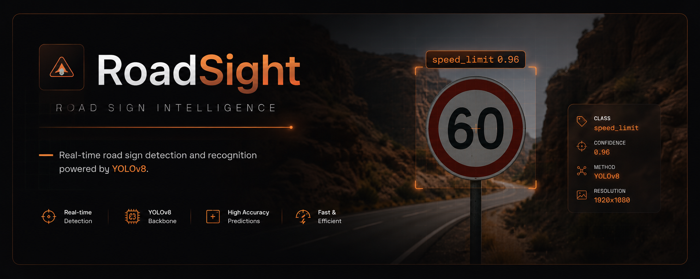
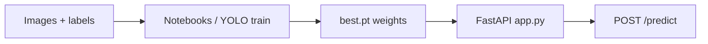
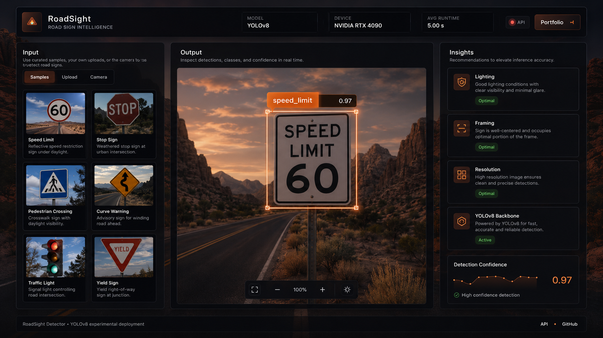

<p align="center">
  
</p>

<p align="center">
  <strong>Ultralytics YOLO · FastAPI · OpenCV · PyTorch</strong><br />
  <em>REST API for detecting Brazilian road signs — traffic lights, stops, speed limits, and crosswalks.</em>
</p>

<p align="center">
  <a href="https://github.com/sidnei-almeida/road_sign_detection_yolo"><strong>github.com/sidnei-almeida/road_sign_detection_yolo</strong></a>
</p>

<p align="center">
  
  
  
  
  
</p>

---

## Overview

**Road Sign Detection (YOLO)** packages a custom **Ultralytics YOLO** detector behind a **FastAPI** service. Upload a street-scene image and receive **bounding boxes**, **class labels**, **confidence scores**, optional **annotated PNG (base64)**, and **latency** in milliseconds.

**Supported classes (canonical names):**

| Class | Typical use |
|--------|-------------|
| **Traffic Light** | Signal heads at intersections |
| **Stop** | Stop signs |
| **Speedlimit** | Regulatory speed plates |
| **Crosswalk** | Pedestrian crossings |

Class names are normalized in code (`to_canonical`) so minor label variants from training still map to these four categories.

---

## End-to-end workflow



1. **Data** — Dataset config in `dados/road_signs_dataset.yaml` (class list, train/val paths). Sample images under `dados/image_examples/` for smoke tests.
2. **Training** — YOLO training artifacts land under `resultados/runs/detect/train/weights/` (e.g. `best.pt`). Notebooks in `notebooks/` cover EDA, preprocessing, and training (portfolio workflow).
3. **Serving** — `app.py` loads weights from `modelos/best.pt`, training output paths, or **`MODEL_URL`** / GitHub raw fallbacks at startup.
4. **Inference** — `MODEL.predict()` with tunable `conf_threshold`, `iou_threshold`, and `image_size` (default **416**). Device: **CUDA**, **MPS**, or **CPU**.

---

## Demo UI (frontend)

Any client can call the API. The layout below illustrates a **RoadSight**-style experience: sample gallery, live detection overlay, and confidence feedback.

<p align="center">
  
</p>

<p align="center">
  <sub>Example UI wired to <code>POST /predict</code> (optional <code>include_image=true</code> for annotated frames).</sub>
</p>

---

## Deploy no Hugging Face Spaces

Este repositório está configurado como **Docker Space**. O bloco YAML no topo deste `README.md` define `sdk: docker` e `app_port: 7860`.

### Criar o Space

1. Acesse [huggingface.co/new-space](https://huggingface.co/new-space).
2. Escolha **Docker** como SDK e conecte este repositório GitHub (ou faça push direto para o Space).
3. Garanta que `modelos/best.pt` esteja no repositório (ou use **Git LFS** para arquivos grandes).
4. Opcional: em **Settings → Repository secrets**, defina **`MODEL_URL`** com uma URL HTTPS direta do `.pt` se os pesos não estiverem no build.
5. Após o build, abra **`/docs`** para o Swagger UI ou chame **`POST /warmup`** para reduzir cold start.

### Variáveis de ambiente no Space

Configure em **Settings → Variables and secrets**:

| Variável | Descrição | Padrão |
|----------|-----------|--------|
| `MODEL_URL` | URL HTTPS para baixar `.pt` na inicialização | — |
| `DEFAULT_IMAGE_SIZE` | Tamanho YOLO padrão em `/predict` | `416` |
| `CORS_ORIGINS` | Origens CORS (vírgula) ou `*` | `*` |

> **Nota:** PyTorch + YOLO consome bastante RAM. O tier **CPU basic** do Spaces costuma ser o mínimo viável; tiers menores podem falhar no boot.

### Testar o Space publicado

Substitua `SEU_USUARIO` e `SEU_SPACE` pela URL do seu Space:

```bash
curl https://SEU_USUARIO-SEU_SPACE.hf.space/health

curl -X POST "https://SEU_USUARIO-SEU_SPACE.hf.space/predict?include_image=true" \
  -F "file=@dados/image_examples/road0.jpg"
```

Documentação: [Docker Spaces](https://huggingface.co/docs/hub/spaces-sdks-docker).

---

## Quick start (local)

**Requirements:** Python **3.10+**, Git **LFS** if you clone large `.pt` weights tracked in `.gitattributes`.

```bash
git clone https://github.com/sidnei-almeida/road_sign_detection_yolo.git
cd road_sign_detection_yolo

git lfs install && git lfs pull   # if weights are LFS-tracked

python -m venv .venv
source .venv/bin/activate   # Windows: .venv\Scripts\activate

pip install --upgrade pip
pip install -r requirements.txt

# Place weights at modelos/best.pt OR set MODEL_URL to a direct .pt URL
bash run_app.sh
```

API base URL: **`http://0.0.0.0:8000`** (override com env **`PORT`**).

Open **`http://127.0.0.1:8000/docs`** for interactive OpenAPI.

---

## API reference

| Method | Path | Description |
|--------|------|-------------|
| GET | `/` | Service message and endpoint map |
| GET | `/health` | `ready` vs `model_not_loaded` |
| GET | `/model/info` | Weights path, classes, device, Torch / Ultralytics versions |
| GET | `/classes` | List of class names |
| POST | `/predict` | Multipart image + query params (see below) |
| POST | `/warmup` | Inferência dummy para reduzir latência após cold start |

### `POST /predict` parameters

| Parameter | Default | Role |
|-----------|---------|------|
| `file` | — | Image upload (PNG / JPG) |
| `conf_threshold` | `0.25` | Minimum detection confidence |
| `iou_threshold` | `0.5` | NMS IoU threshold |
| `image_size` | `416` | YOLO inference size |
| `include_image` | `false` | If `true`, returns `annotated_image_base64` (PNG) |

### Example

```bash
curl -X POST "http://localhost:8000/predict?include_image=true" \
  -F "file=@dados/image_examples/road0.jpg"
```

```json
{
  "detections": [
    {
      "class_name": "Traffic Light",
      "confidence": 0.92,
      "bounding_box": { "x1": 123, "y1": 45, "x2": 210, "y2": 300 }
    }
  ],
  "inference_time_ms": 56.42,
  "image_width": 1280,
  "image_height": 720,
  "annotated_image_base64": "..."
}
```

---

## Model weights

Resolution order at startup:

1. `modelos/best.pt`
2. `resultados/runs/detect/train/weights/best.pt`
3. `modelos/last.pt` / `resultados/.../last.pt`
4. Download from **`MODEL_URL`** (if set), then built-in GitHub raw URLs in `app.py`

Files under **`modelos/*.pt`** are intended for **Git LFS** (see `.gitattributes`).

---

## Environment variables

| Variable | Description | Default |
|----------|-------------|---------|
| `MODEL_URL` | HTTPS URL to download `.pt` weights at startup | — |
| `PORT` | Uvicorn listen port (`7860` no Docker/Spaces, `8000` local) | `8000` local / `7860` Docker |
| `DEFAULT_IMAGE_SIZE` | YOLO `imgsz` default for `/predict` | `416` |
| `CORS_ORIGINS` | Origens permitidas (vírgula) ou `*` | `*` |

---

## Docker (local ou HF Spaces)

- **`Dockerfile`**: Python 3.10 slim, OpenGL libs for OpenCV, PyTorch CPU, roda **`uvicorn app:app`** na porta **`7860`** (padrão HF Spaces).
- Set **`MODEL_URL`** ou inclua os pesos em `modelos/`.

```bash
docker build -t road-sign-api .
docker run -p 7860:7860 -e MODEL_URL="https://..." road-sign-api
```

Abra **`http://localhost:7860/docs`** após subir o container.

---

## Project structure

```
road_sign_detection_yl/
├── app.py                 # FastAPI + YOLO inference
├── Dockerfile             # Hugging Face Spaces (Docker SDK)
├── requirements.txt
├── run_app.sh             # Local uvicorn launcher
├── dados/
│   ├── road_signs_dataset.yaml
│   ├── road_signs_annotations.csv
│   └── image_examples/
├── modelos/               # best.pt (LFS)
├── resultados/            # YOLO training runs
├── notebooks/             # EDA, training, evaluation
├── images/
│   ├── header.png
│   └── software.png
└── LICENSE
```

---

## Testing

```bash
curl http://localhost:8000/health

curl -X POST "http://localhost:8000/predict" \
  -F "file=@dados/image_examples/road0.jpg"
```

---

## Disclaimer

Computer-vision outputs are **probabilistic**. Do not rely on this API alone for safety-critical driving or regulatory compliance. Validate on your own data and hardware.

---

## License

This project is released under the **[MIT License](LICENSE)**.

---

## Author

**Sidnei Alves de Almeida** — [@sidnei-almeida](https://github.com/sidnei-almeida)
